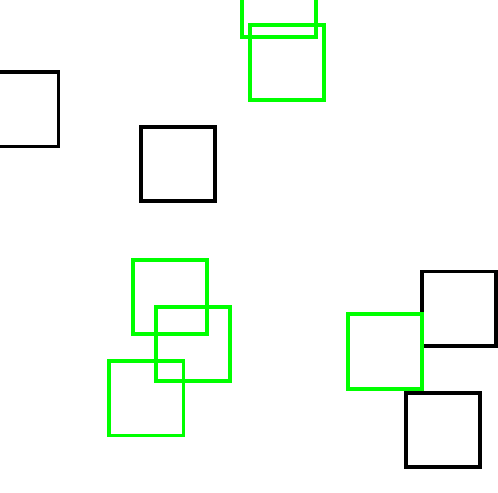

# Uniform Grid with SDL2

An uniform grid collision made in sdl2 for learning proposities. Vcpkg are used as the package manager, but if do not want to used it, you can download the binaries in the SDL2 official site.

## Example Image

In the image below the greens squares, are colliding with another green square.

## Commands

Left mouse click - To place a new square